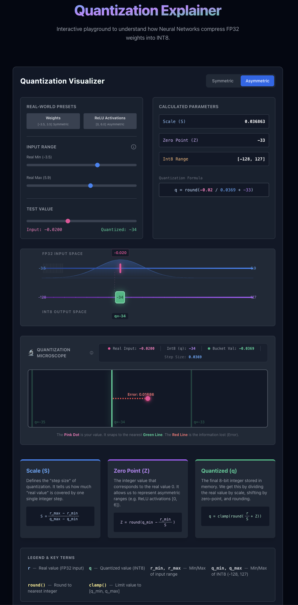

# 🧠 Neural Network Quantization Visualizer

An interactive, animated educational tool built with **React** to demystify how Neural Networks are quantized from Floating Point (FP32) to Integers (INT8).




## 🚀 What is this?

Quantization is the process of mapping continuous real-world values (like $-3.5$ to $+3.5$) to a discrete set of integers (like $-128$ to $+127$). It is the secret sauce that allows large AI models to run on phones and edge devices.

This tool helps you visualize:
*   **The "Buckets"**: precise quantization steps on the number line.
*   **The Math**: How Scale ($S$) and Zero-Point ($Z$) are calculated in real-time.
*   **The Trade-off**: Symmetric vs. Asymmetric quantization.

## ✨ Features

*   **Interactive Number Line**: Drag the input value and watch it "snap" to the nearest quantized integer bucket.
*   **Live Formula**: Watch the equation $q = S(r - Z)$ update instantly as you change range parameters.
*   **Symmetric & Asymmetric Modes**: Toggle between modes to see how Zero-Point ($Z$) shifts to accommodate different input ranges.
*   **Visual Grid**: Faint grid lines show exactly where the "rounding boundaries" are.
*   **Educational Tooltips**: Built-in explanations for concepts like Clipping and Input Range.

## 🧮 The Math Explained

The visualizer implements the standard linear quantization formula:

$$r = S(q - Z)$$

Where:
*   $r$: Real value (Input)
*   $q$: Quantized Integer (Output, -128 to 127)
*   $S$ (Scale): The "step size" of the buckets.
    $$S = \frac{r_{max} - r_{min}}{q_{max} - q_{min}}$$
*   $Z$ (Zero-Point): The integer value that represents real zero ($0.0$).
    $$Z = \text{round}(q_{min} - \frac{r_{min}}{S})$$

## 🛠️ Stack

*   **React 18** (UI Framework)
*   **Vite** (Build Tool)
*   **Framer Motion** (Smooth Animations)
*   **TailwindCSS** (Styling)

## 🏃‍♂️ How to Run

1.  **Clone the repo**
    ```bash
    git clone https://github.com/your-username/quant-visualizer.git
    cd quant-visualizer
    ```

2.  **Install dependencies**
    ```bash
    npm install
    ```

3.  **Start the dev server**
    ```bash
    npm run dev
    ```

4.  Open `http://localhost:5173` to start learning!

## 🤝 Contributing

Visualizations for "Data Distribution" and "Quantization Error" are coming soon! Feel free to open a PR if you have ideas for better animations.

---
*Built with ❤️ for AI Learners*
